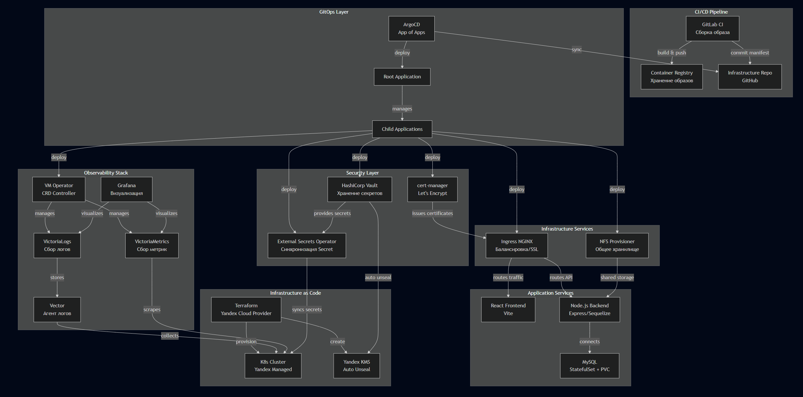
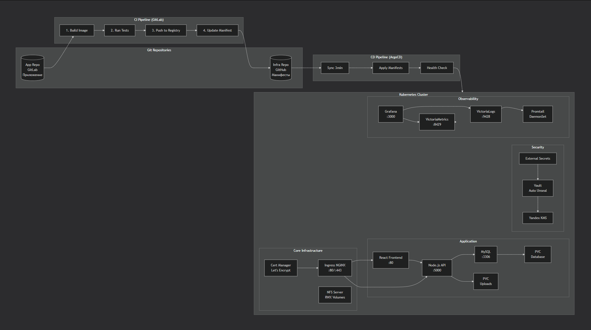
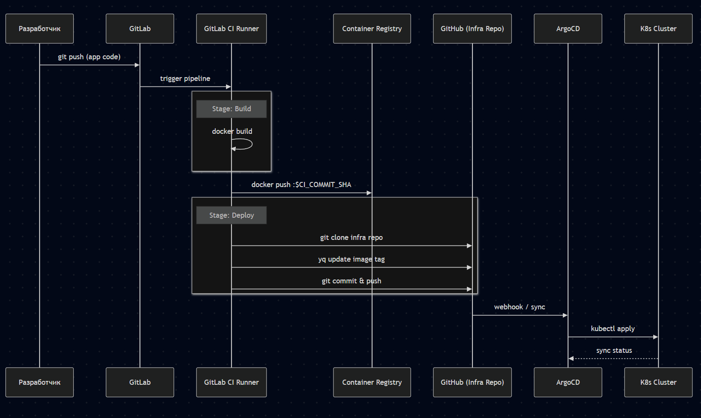
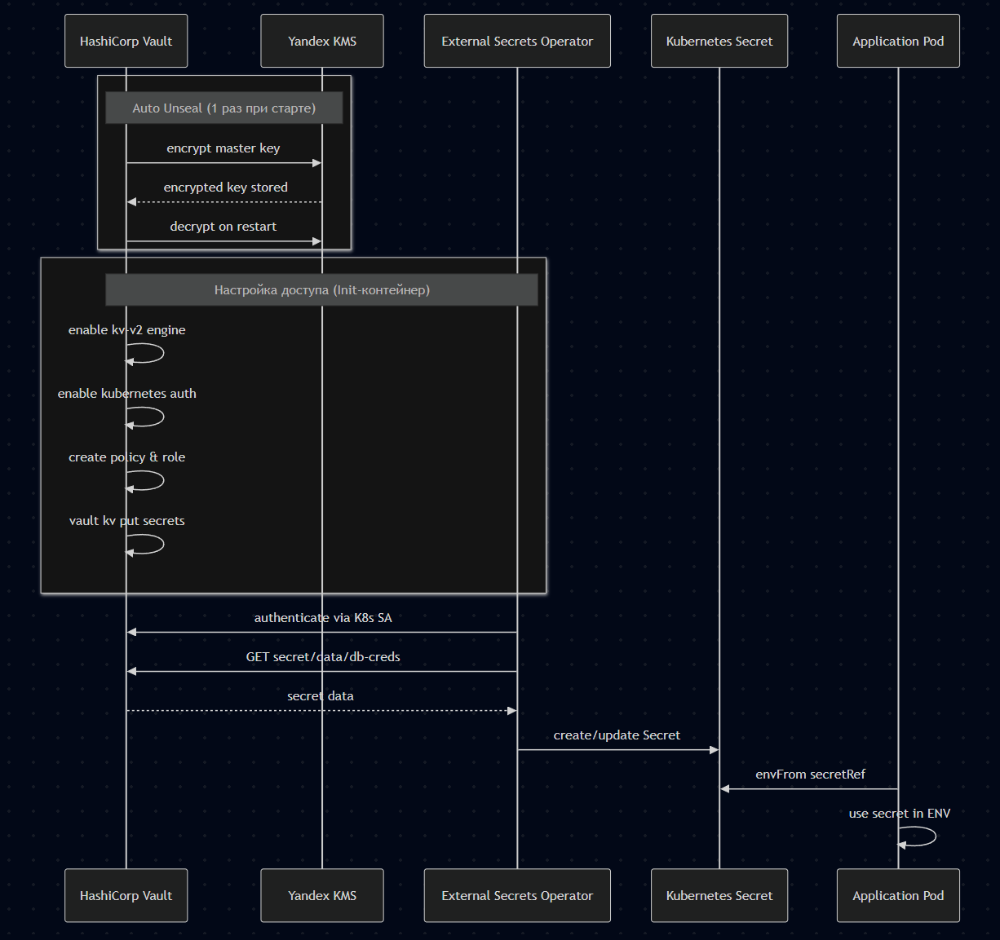
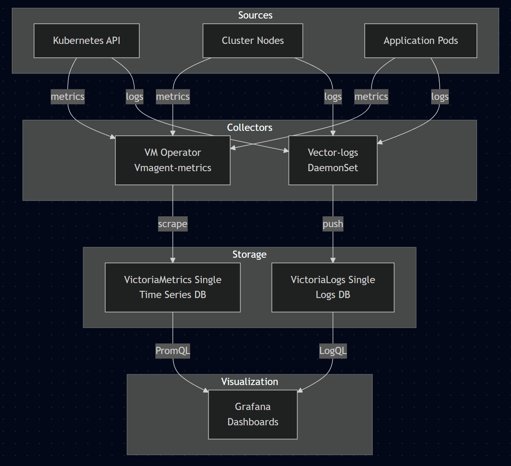

<div align="center">
Проект представляет собой реализацию современного производственного (Production-ready) цикла для развертывания fullstack приложения, управления инфраструктурой и доставки обновлений в облаке Yandex Cloud.
  <div>
    
    
    
    
    
    
    
    
  </div>
</div>

# Оглавление

- Архитектура проекта

- Технологический стек

- Компоненты и их взаимодействие

- CI/CD Pipeline

- Инфраструктура безопасности

- Мониторинг и Observability

- Структура репозиториев

- Быстрый старт

- Лицензия

# Архитектура проекта

1. Infrastructure as Code (IaC)Terraform: Используется для управления жизненным циклом облачных ресурсов (Provisioning).
Создание сети (VPC, Subnets) и вычислительных ресурсов (Managed Service for Kubernetes).
Управление безопасностью через IAM (Service Accounts, Roles).
Использование Yandex KMS для криптографических операций (Auto-unseal Vault).
Terraform Helm Provider: Используется исключительно для инициализации "фундамента" — установки ArgoCD.

2. GitOps & Continuous Delivery (CD)
ArgoCD: Центральный контроллер доставки. Реализует паттерн "App of Apps".
Синхронизация состояния кластера с Git-репозиторием (Single Source of Truth).
Автоматический мониторинг дрейфа конфигурации (Self-healing).
Helm: Пакетный менеджер. Все компоненты (Ingress, Vault, App...) упакованы в чарты для управления зависимостями и параметризации через values.yaml.

3. Secret Management & Security
HashiCorp Vault (Raft HA): Хранилище секретов в режиме высокой доступности с интегрированным хранилищем Raft.
Интеграция с Yandex KMS для автоматического разпечатывания (Auto-unseal).
External Secrets Operator (ESO): Автоматизирует синхронизацию секретов из Vault в нативные Kubernetes Secrets.
Метод аутентификации: Kubernetes Auth Method (через ServiceAccounts).
Cert-Manager: Автоматизация выпуска TLS-сертификатов от Let's Encrypt через HTTP-01/DNS-01 челленджи.

4. Infrastructure Services
Ingress Nginx Controller: Точка входа трафика в кластер с поддержкой балансировки и терминации SSL.
NFS Server Provisioner: Обеспечение общего хранилища (Shared Storage) для распределенных компонентов приложения (ReadWriteMany).

5. Continuous Integration (CI)
GitLab CI:
Build Stage: Сборка Docker-образов с использованием Docker-in-Docker(DinD).
Registry: Хранение артефактов в Docker Container Registry.
Deploy Stage: Автоматическое обновление тегов образов в GitOps-репозитории.

6. Observability (Full Monitoring Stack)
VictoriaMetrics & Grafana: Сбор метрик с инфраструктуры и приложения, визуализация состояния через дашборды.
VictoriaLogs & Vector: Централизованный сбор и агрегация логов со всех подов кластера.

### Общая схема взаимодействия



### Детальная схема компонентов



# Технологический стек

### Infrastructure & Orchestration

|Технология | Версия | Назначение
|---|---|---
|Kubernetes | 1.28 | Оркестрация контейнеров (Yandex Managed)
|Terraform | 1.6+ | Infrastructure as Code
|Helm | 3.13+ | Package manager для K8s
|ArgoCD | 2.10+ | GitOps непрерывная доставка
|GitLab CI | Latest | CI/CD пайплайны


### Security & Secrets

|Технология | Версия | Назначение
|---|---|---
|HashiCorp Vault | 1.15+ | Хранение и управление секретами
|External Secrets Operator | 0.9+ | Синхронизация Vault → K8s Secrets
|Cert-manager | 1.13+ | Автоматические SSL сертификаты
|Yandex KMS | - | Auto Unseal для Vault

### Observability

|Технология | Версия | Назначение
|---|---|---
|VictoriaMetrics | Latest | Сбор и хранение метрик
|VictoriaLogs | Latest | Сбор и хранение логов
|Grafana | 10+ | Визуализация метрик и логов
|Promtail | Latest | Агент сбора логов

### Networking & Storage

|Технология | Версия | Назначение
|---|---|---
|Ingress NGINX | 1.9+ | Балансировка и SSL терминация
|NFS Server Provisioner | Latest | Общее хранилище RWX
|CoreDNS | 1.11+ | DNS внутри кластера

### Application Stack

|Компонент | Технологии
|---|---
|Backend | Node.js, Express, Sequelize, JWT, 2FA
|Frontend | React, Vite, CSS, MobX, Axios
|Database | MySQL 8.0 (StatefulSet + PVC)

# Компоненты и их взаимодействие

## CI/CD Pipeline Flow



## Security Flow (Vault + ESO)



## Observability Flow



### CI/CD Pipeline

```yaml
stages:
  - build
  - deploy

build:
  stage: build
  image: docker:latest
  services:
    - docker:dind
  before_script:
    - docker login -u $CI_REGISTRY_USER -p $CI_REGISTRY_PASSWORD
    - echo "VITE_API_URL=${VITE_API_URL}" > ./client/.env
  script:
    - docker build -t $IMAGE_NAME:$CI_COMMIT_SHORT_SHA . # Уникальный тег для каждой сборки
    - docker push $IMAGE_NAME:$CI_COMMIT_SHORT_SHA
  only:
    - master

update_manifests:
  stage: deploy
  image: alpine:latest
  before_script:
    - apk add --no-cache git yq
  script:
    - git config --global user.email "gitlab@runner.com"
    - git config --global user.name "CI runner"

    - git clone https://oauth2:${GITHUB_TOKEN}@${GITHUB_REPO} infra
    - cd infra/charts/app-chart

    - yq -i '.server.container.tag = "'$CI_COMMIT_SHORT_SHA'"' values-prod.yaml
    - git diff --quiet && exit 0

    - git add values-prod.yaml
    - git commit -m "CD update app image tag to $CI_COMMIT_SHORT_SHA"
    - git push origin master
```

Pipeline Steps:
Build — сборка Docker образа с многоступенчатой оптимизацией и публикация образа в Docker Container Registry.

Deploy — обновление values.yaml путем коммита в инфраструктурном репозитории (GitHub) с новым тегом.

### Инфраструктура безопасности: Vault + YC KMS + External Secrets Operator

```yaml
# Взаимодействие компонентов
Vault (Auto Unseal via Yandex KMS)
  ├── secrets engine: kv-v2 (path: secret/)
  ├── auth method: kubernetes
  ├── policy: app-policy (read secret/data/*)
  └── role: eso-role (bound SA: vault-sa)

External Secrets Operator
  ├── reads secrets from Vault
  ├── creates K8s Secret
  └── sync period: 1 hour

Application
  └── envFrom: secretRef (K8s Secret)
```

### SSL/TLS (cert-manager)

```yaml
Issuer: ClusterIssuer (Let's Encrypt)
  ├── server: acme-v02.api.letsencrypt.org
  ├── solver: http01 (ingress)
  └── email: admin@domain.com

Certificate
  ├── secretName: domain-tls-secret
  ├── dnsNames: [domain.com, www.domain.com]
  └── issuerRef: letsencrypt-prod
```

### Мониторинг и Observability

Метрики (VictoriaMetrics)

```yaml
k8s-metrics:
  - node_exporter (CPU, RAM, Disk, Network)
  - kube-state-metrics (pods, deployments, services)
  - kubelet (cadvisor: container metrics)
  - api-server, controller-manager, scheduler
  - core-dns, etcd

app-metrics:
  - http_requests_total (rate, errors, latency)
  - db_connection_pool (active, idle, wait)
  - business_metrics (users, orders, etc.)
```

Логи (VictoriaLogs)

```logql
# Получить логи пода с ошибками
{pod="backend-xxx", namespace="prod"} |~ "(?i)error|fatal|exception"

# Фильтр по временному диапазону
{app="frontend"} |= "GET /api" |= "500"

# Агрегация ошибок по namespace
sum by (namespace) (count_over_time({pod=~".*"} |= "error" [5m]))
```

### Grafana Dashboards

|Dashboard | Источник | Описание
|---|---|---
|K8s Cluster Monitoring | VictoriaMetrics | Состояние кластера, ресурсы нод
|Pods Dashboard | VictoriaMetrics | CPU/Memory per pod, restarts
|App Metrics | VictoriaMetrics | RPS, ошибки, latency
|Logs Explorer | VictoriaLogs | Поиск и фильтрация логов

# Структура репозиториев

### Application Repository (GitLab)

```text
rent/
├── client/                 # React + Vite фронтенд
│   ├── src/
│   ├── public/
│   └── package.json
├── server/                 # Node.js + Express бэкенд
│   ├── src/
│   │   ├── controllers/
│   │   ├── models/
│   │   ├── routes/
│   │   └── services/
│   ├── Dockerfile
│   └── package.json
├── .gitlab-ci.yml         # CI/CD пайплайн
└── README.md
```

### Infrastructure Repository (GitHub)

```text
infrastructure/
├── terraform/              # IaC для Yandex Cloud
│   ├── main.tf            # кластер, сети, диски, KMS
│   ├── variables.tf
│   └── outputs.tf
├── argocd/                 # GitOps манифесты
│   ├── root-app.yaml      # App of Apps
│   └── apps/
│       ├── cert-manager.yaml
│       ├── ingress-nginx.yaml
│       ├── nfs-server.yaml
│       ├── vault.yaml
│       ├── external-secrets.yaml
│       └── rent-app.yaml
├── charts/                 # Helm чарты
│   ├── vault/values.yaml
│   ├── monitoring/values.yaml
│   └── rent-app/values.yaml
└── README.md
```

# Быстрый старт

Prerequisites

- Yandex Cloud аккаунт
- GitLab проект с кодом приложения
- GitHub репозиторий для инфраструктуры
- Установленные: terraform, helm, kubectl

Step 1: Развернуть инфраструктуру

```bash
cd argocd-infrastructure-repo/terraform
terraform init
terraform apply -auto-approve
```

Step 2: Применить главный файл argo (App of Apps)

```bash
kubectl apply -f argocd/root-app.yaml
```

Step 3: Настроить A-DNS запись домена в интерфейсе провайдера на IP Ingress контроллера кластера, для прохождения HTTP челленджа (TLS).

Step 4: Настроить GitLab CI

```bash
# Добавить переменные в GitLab CI/CD Settings:
- CI_REGISTRY_USER
- CI_REGISTRY_PASSWORD
- GITHUB_TOKEN
- VAULT_ADDR
- VAULT_TOKEN
```
